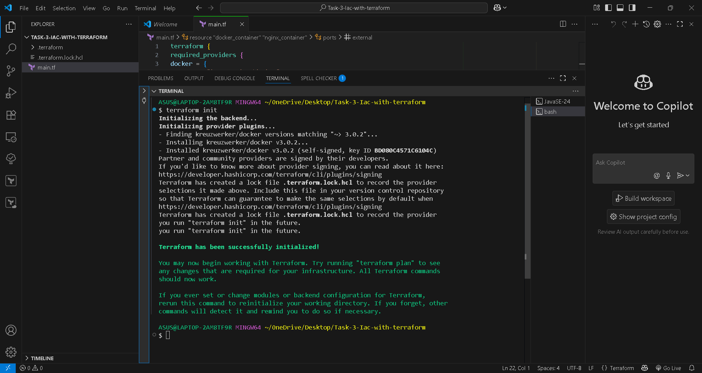
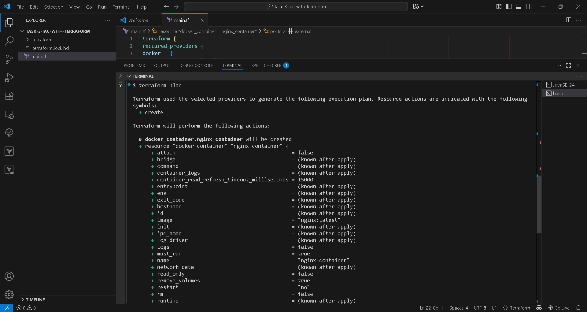
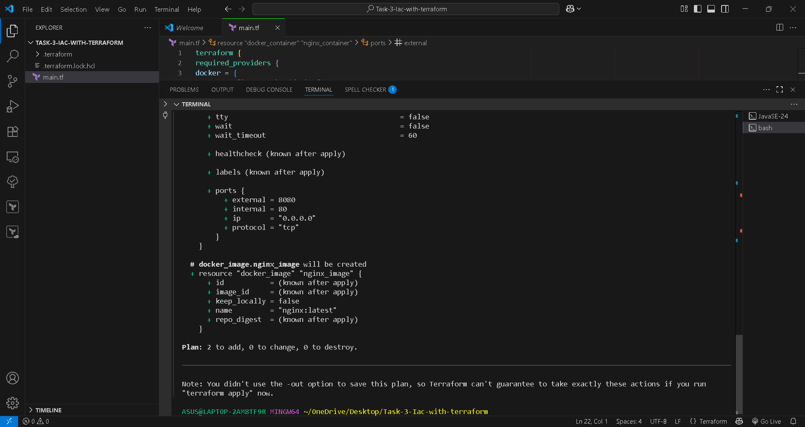
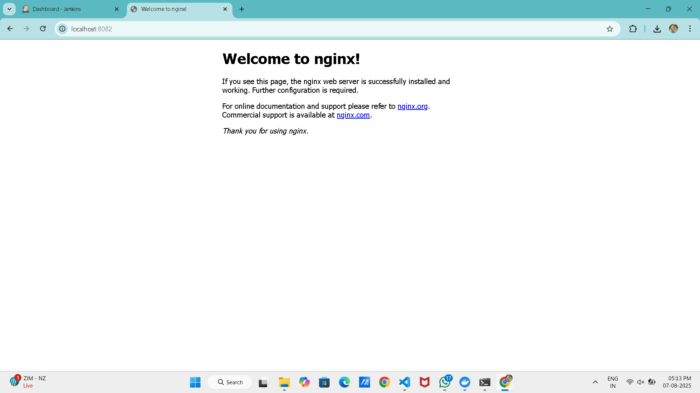
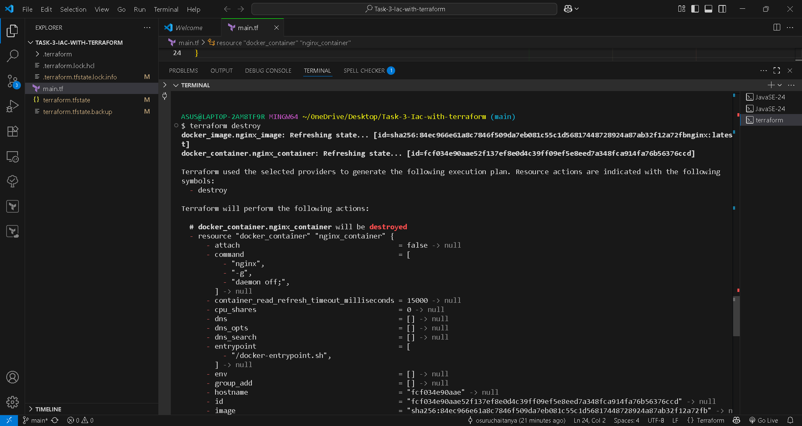
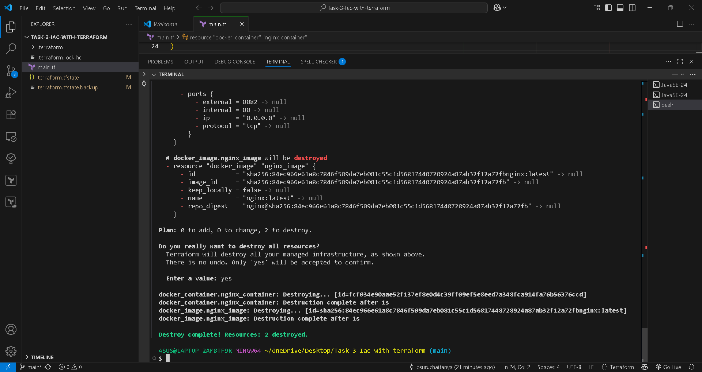

# Task 3 - Infrastructure as Code (IaC) with Terraform and Docker (Local)

## 📌 Objective

Use *Terraform* to provision and manage infrastructure locally by deploying an *Nginx container* using *Docker*, without relying on any cloud provider.

---

## 📁 Project Structure

task-3-iac-with-terraform/ ├── main.tf              # Terraform configuration ├── terraform.tfstate    # Terraform state file (auto-generated after apply) ├── .terraform/          # Terraform plugin files (auto-generated) └── README.md            # Project documentation

---

## ⚙ Tools Used

- [Terraform](https://www.terraform.io/) – Infrastructure as Code
- [Docker](https://www.docker.com/) – Containerization
- [Nginx](https://hub.docker.com/_/nginx) – Web Server image
- Local Windows/Linux machine (no cloud)

---

## 🚀 Steps to Run the Project

### 1. 📁 Clone the Repository (or create your working folder)

```bash
git clone https://github.com/yourusername/task-3-iac-with-terraform.git
cd task-3-iac-with-terraform

2. 📄 Create main.tf

Paste the following code in your main.tf file:

terraform {
  required_providers {
    docker = {
      source  = "kreuzwerker/docker"
      version = "~> 3.0.2"
    }
  }
}

provider "docker" {}

resource "docker_image" "nginx_image" {
  name         = "nginx:latest"
  keep_locally = false
}

resource "docker_container" "nginx_container" {
  name  = "nginx_container"
  image = docker_image.nginx_image.latest

  ports {
    internal = 80
    external = 8081
  }
}


---

3. 🛠 Initialize Terraform

terraform init

4. ✅ Validate the Configuration

terraform validate

5. 📦 Apply Configuration

terraform apply

Type yes when prompted.


---

🌐 Verify

Open your browser and go to:

http://localhost:8081

You should see the Nginx Welcome Page.


---

🧹 (Optional) Destroy the Container

To stop and delete the container and image:

terraform destroy


---

📌 Notes

This project is fully local. No cloud or remote infrastructure is used.

Ensure Docker Desktop is running before executing Terraform.

Change external port in main.tf if 8081 is already in use.


---

## 📸 Screenshots
Attach the image:
### ✅ Terraform Init  


### ✅ Terraform Validate  


### ✅ Terraform Plan  


### ⚙ Terraform Apply - Part 1  


### ⚙ Terraform Apply - Part 2  


### 🌐 Nginx Running in Browser  


### ❌ Terraform Destroy - Part 1  


### ❌ Terraform Destroy - Part 2  

